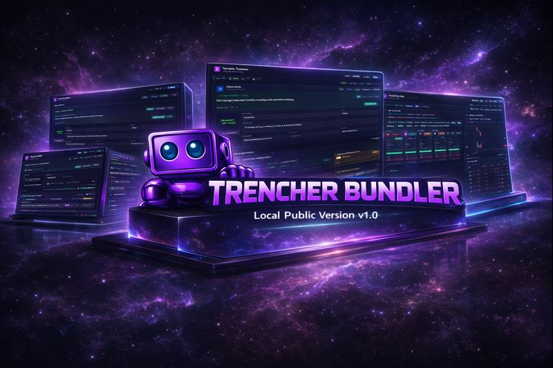
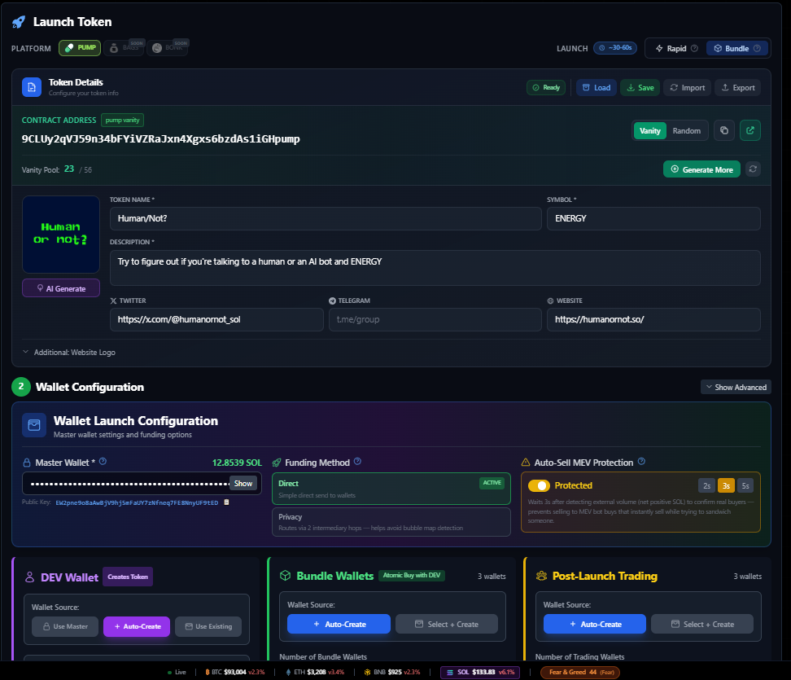
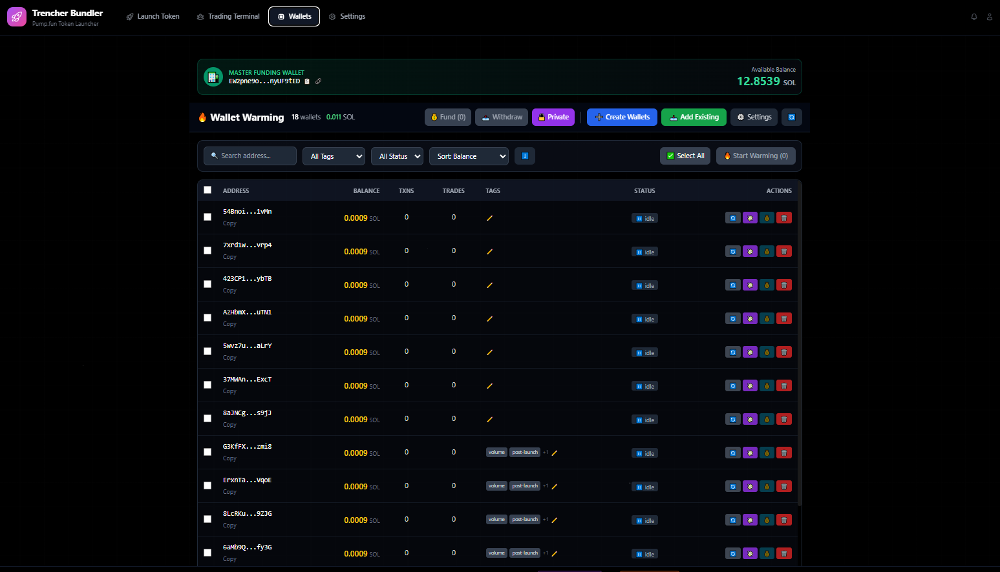
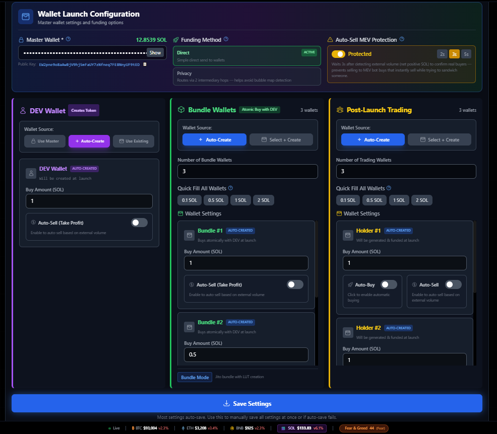
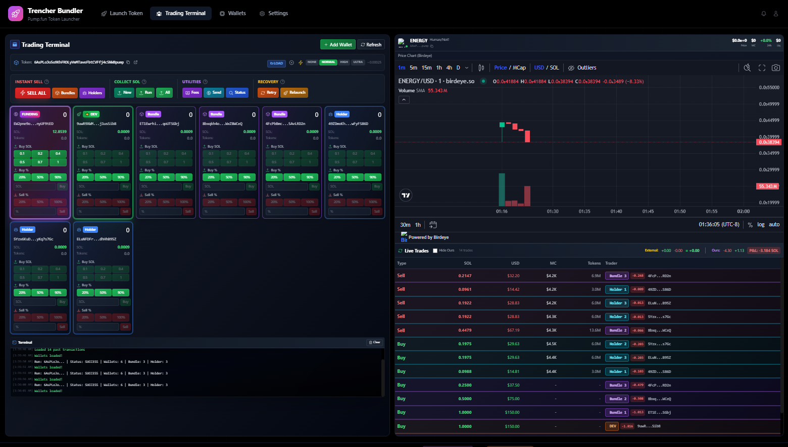

# 🚀 Trencher Bundler

**The ONLY Pump.fun bundler with a full web dashboard.** Launch tokens, manage wallets, auto-sell, and track P&L — all from one page.

[](https://opensource.org/licenses/MIT)

## 🎯 Why Trencher Bundler?



Trencher Bundler isn't just another token launcher. We built the most complete bundling solution for Pump.fun that handles everything from launch to profit-taking.

**What sets us apart:**

- **Rapid Wallet Market Making** - Once your token launches, the system automatically creates and manages wallets for post-launch market making. Set it and forget it.

- **Intelligent Auto-Buying & Selling** - Configure automatic buying and selling based on external SOL volume. The system monitors market activity and executes trades when conditions are met, taking profits at the right moments.

- **Smart Profit Taking** - Built-in profit-taking logic analyzes external trader volume to determine optimal exit points. Stop guessing when to sell.

- **Wallet Mixing & Privacy** - Advanced wallet mixing with intermediary hops for enhanced privacy. All private keys are automatically saved to `archive.txt` during cross-chain mixing and intermediary wallet operations, so you never lose access to your funds even if something fails mid-process.

- **Cross-Chain Bubble Maps** - Integrated support for cross-chain swaps via bubble maps, letting you move liquidity across chains seamlessly.

Whether you're launching your first token or managing multiple launches, Trencher Bundler provides the tools and automation you need.

**Connect with us:**
- 🌐 Website: [trencherbundler.fun](https://trencherbundler.fun)
- 🐦 Twitter: [@trencherbundler_x](https://x.com/trencherbundler_x)
- 💬 Telegram: [@dogtoshi_x](https://t.me/dogtoshi_x)

## ✨ Features

- **🎯 Single-Page Dashboard** - Complete control from one beautiful UI
- **⚡ Jito Bundle Execution** - Launch tokens with coordinated buys in the same block
- **💼 Wallet Management** - Create, warm, and manage unlimited wallets
- **📊 Real-Time P&L Tracking** - Track profits/losses across all wallets
- **🤖 Auto-Sell** - Configure automatic selling at price thresholds
- **⚡ Rapid Sell** - Instantly sell all positions via Jito bundles
- **🔐 Secure Key Management** - All keys saved locally, never exposed
- **💾 Fund Recovery** - Built-in tools to recover stuck SOL from failed launches

## 📸 Screenshots

### Token Launch Configuration

*Configure and launch your token with bundled buys*

**Key Features:**
- **Token Info** - Set name, symbol, description, and upload logo
- **DEV Buy** - Configure the first buy amount from creator wallet
- **Bundle Wallets** - Select wallets and amounts for coordinated bundle buys
- **Post-Launch Trading** - Configure holder wallets for post-launch trading
- **Fee Breakdown** - See detailed SOL breakdown (bundle wallets, holder wallets, DEV buy, Jito fee, LUT creation, buffer)
- **Launch Token** - Start the launch process

### Wallet Management

*Create, warm, and manage wallets*

**Key Features:**
- **Create Wallets** - Generate fresh bundle/holder wallets
- **Warm Wallets** - Pre-fund wallets for faster launches
- **Wallet List** - View all wallets with balances and status
- **Auto-Sell Config** - Configure automatic selling per wallet
- **Select Wallets** - Choose which wallets to use for launches

### DEV, Bundle & Holder Wallet Configuration

*Detailed wallet configuration and auto-sell settings*

**Key Features:**
- **DEV Wallet Card** - Shows DEV wallet address, balance, and auto-sell toggle
- **Bundle Wallet Cards** - Individual cards for each bundle wallet with:
  - Wallet address and balance
  - Buy amount configuration
  - Auto-sell toggle and threshold
  - Funding status
- **Post-Launch Trading Cards** - Holder wallet configuration with auto-sell
- **Auto-Sell Settings** - Configure price thresholds and sell percentages per wallet
- **MEV Protection** - Enable delays to avoid front-running

### Trading Terminal

*Real-time trading, P&L tracking, and position management*

**Key Features:**
- **Live Trades Feed** - Real-time buy/sell transactions from PumpPortal
- **P&L Tracking** - Track profits/losses across all wallets
- **Wallet Positions** - See token balances and SOL balances per wallet
- **Quick Actions:**
  - **Sell All** - Instantly sell all positions via Jito bundle
  - **Gather** - Recover SOL from all wallets
  - **Status** - Check wallet and token status
- **Recovery Section:**
  - **Retry** - Retry failed bundle submission (uses existing wallets)
  - **Relaunch** - Start a completely new launch

## 🛠️ Quick Start

### Prerequisites

- **Node.js 18+** ([Download](https://nodejs.org/))
- **Solana RPC Endpoint** - **HIGHLY RECOMMENDED:** Use a dedicated RPC service
  - **Free tier works fine!** Get free Helius RPC: https://helius.dev
  - Public RPC will cause rate limits and failed launches
- **SOL** for transaction fees and token launches

### Installation

```bash
# Clone the repository
git clone https://github.com/dogtoshi-sz/pumpfun-bundler-launcher-react-dashboard.git
cd pumpfun-bundler-launcher-react-dashboard

# Install root dependencies
npm install

# Install API server dependencies
cd api-server
npm install

# Install frontend dependencies
cd ../frontend
npm install
cd ..
```

### Configuration

1. **Copy the example environment file:**
   ```bash
   cp .env.example .env
   ```

2. **Edit `.env` with your settings:**
   ```env
   # REQUIRED - Your main funding wallet private key (base58)
   PRIVATE_KEY=your_private_key_here
   
   # REQUIRED - Solana RPC endpoint (use Helius/QuickNode for best results)
   RPC_ENDPOINT=https://mainnet.helius-rpc.com/?api-key=YOUR_KEY
   RPC_WEBSOCKET_ENDPOINT=wss://mainnet.helius-rpc.com/?api-key=YOUR_KEY
   
   # Token settings (configure before launch)
   TOKEN_NAME=Your Token Name
   TOKEN_SYMBOL=SYMBOL
   FILE=./image/your-logo.png
   ```

3. **Start the API server** (Terminal 1):
   ```bash
   cd api-server
   node control-panel-server.js
   ```

4. **Start the frontend** (Terminal 2):
   ```bash
   cd frontend
   npm run dev
   ```

5. **Open your browser:**
   ```
   http://localhost:5173
   ```

## 📖 How It Works

### 🎯 The Bundler System

Trencher Bundler uses **Jito bundles** to coordinate multiple transactions in a single block:

1. **Token Creation** - Creates your token on Pump.fun
2. **DEV Buy** - First buy from your creator wallet (right after creation)
3. **Bundle Buys** - Multiple wallets buying simultaneously in the same block
4. **Jito Execution** - All transactions bundled and sent via Jito block engine

**Why Jito?**
- **Atomic Execution** - All buys land in the same block or none do
- **MEV Protection** - Harder for bots to front-run your launch
- **Speed** - Faster than sending transactions individually

### 🔧 Lookup Tables (LUTs)

The bundler automatically creates and uses **Address Lookup Tables (LUTs)** to:
- Reduce transaction size (allows more wallets per bundle)
- Lower transaction fees
- Enable larger bundles (up to 20+ wallets)

LUTs are created automatically and extended as needed. You can view them on Solana Explorer.

### 💾 File Structure & Key Management

**All wallet keys are saved locally in the `keys/` directory:**

```
keys/
├── current-run.json          # Current launch data (wallets, mint, status)
├── data.json                 # All created wallets (bundle, DEV, holder)
├── warmed-wallets.json       # Pre-warmed wallets for reuse
├── archive.txt               # ALL private keys backup (critical for recovery)
├── intermediary-wallets.json # Privacy routing wallets (if enabled)
├── mixing-wallets.json       # Mixing wallets (if privacy mode enabled)
├── pnl/                      # Profit & loss tracking files
│   ├── pnl-*.json           # Per-token P&L data
│   └── profit-loss.json     # Aggregate P&L tracking
├── token-configs/           # Saved token configurations
└── wallet-profiles/         # Saved wallet profiles
```

**Critical Security Notes:**
- ✅ The `keys/` folder is **gitignored** by default
- ✅ All keys are stored **locally only** - never sent anywhere
- ✅ Keys are saved **immediately** after wallet creation
- 🔐 **ALL private keys are automatically saved to `archive.txt`** - This includes:
  - Bundle wallet keys
  - Holder wallet keys
  - DEV wallet keys
  - **Intermediary wallet keys** (during privacy routing)
  - **Mixing wallet keys** (during cross-chain operations)
- ⚠️ **If anything fails during cross-chain mixing or intermediary wallet operations, your keys are safely stored in `archive.txt`**
- ⚠️ **Backup your `keys/` folder regularly!**
- ⚠️ **Never commit or share your `.env` file or `keys/` folder**

### 🔄 How Wallets Are Saved

**During Launch:**
1. Wallets are created and **immediately saved** to `data.json`
2. **All private keys are automatically appended to `archive.txt`** for safety
3. Current run data is saved to `current-run.json` (includes all wallet addresses)
4. If launch fails, wallets are still saved - **your SOL is recoverable**

**During Privacy Operations:**
- When using intermediary wallets or mixing wallets, **all private keys are saved to `archive.txt`** before any cross-chain or mixing operations begin
- This ensures you can recover funds even if the process fails mid-operation

**Wallet Types:**
- **DEV Wallet** - Creator wallet that makes the first buy
- **Bundle Wallets** - Wallets that buy in the Jito bundle
- **Holder Wallets** - Wallets for post-launch trading
- **Intermediary Wallets** - Privacy routing wallets (if enabled)

### 💰 Recovering Stuck Funds

If a launch fails or you need to recover SOL from wallets:

#### Option 1: Gather from Current Run (Recommended)
```bash
npm run gather
```
Recovers SOL from wallets in the most recent launch (`current-run.json`).

#### Option 2: Gather from All Wallets
```bash
npm run gather-all
```
Recovers SOL from **all** wallets in `data.json` (all launches).

#### Option 3: Withdraw from Specific Wallet Types
```bash
# Withdraw from mixing/intermediary wallets only
npm run withdraw-mixing-wallets

# Withdraw from all wallets (including DEV, Bundle, Holder)
npm run withdraw-all-wallets
```

#### Option 4: Recovery Center (Interactive)
```bash
npm run recovery-center
```
Interactive menu to recover from specific wallet types.

**What Gets Recovered:**
- ✅ Native SOL (withdrawable balance)
- ✅ Token account rent (when closing empty token accounts)
- ⚠️ Leaves rent-exempt balance (can't withdraw to zero)

**Note:** The gather scripts automatically:
- Check wallet balances
- Close empty token accounts
- Transfer SOL back to your main funding wallet
- Show detailed recovery summary

## 🎮 Usage Guide

### Launching a Token

1. **Configure Settings** - Go to Settings tab, set your RPC and funding wallet
2. **Prepare Wallets** - Go to Wallets tab:
   - Create fresh wallets, OR
   - Warm existing wallets, OR
   - Use a mix of both
3. **Configure Launch** - Go to Launch Token tab:
   - Set token name, symbol, image
   - Configure DEV buy amount
   - Select bundle wallets and amounts
   - Configure holder wallets (post-launch trading)
4. **Launch** - Click "Launch Token" and watch the progress
5. **Monitor** - Switch to Trading Terminal to see live trades and P&L

### Auto-Sell Configuration

Configure automatic selling per wallet:
- **Threshold** - Price threshold to trigger sell
- **Percentage** - What % of tokens to sell
- **MEV Protection** - Delay selling to avoid front-running

### Rapid Sell

Instantly sell all positions via Jito bundle:
```bash
npm run rapid-sell
```

Or use the "Sell All" button in the Trading Terminal.

## 🎯 Button Reference Guide

### Launch Token Page

#### **Launch Token** (Main Button)
- **What it does:** Starts the complete token launch process
- **Process:** Creates token → Funds wallets → Builds bundle → Sends via Jito
- **When to use:** After configuring all settings (token info, wallets, amounts)

#### **Select Wallets** (DEV/Bundle/Holder sections)
- **What it does:** Opens modal to select which wallets to use
- **Options:**
  - **Use Warmed Wallets** - Select from pre-warmed wallets
  - **Auto-Create** - Create fresh wallets automatically
  - **Select + Create** - Choose some warmed + create new ones
- **When to use:** When you want to choose specific wallets or create new ones

#### **Auto-Sell Toggle** (Per wallet card)
- **What it does:** Enables/disables automatic selling for that wallet
- **When enabled:** Wallet will automatically sell when price threshold is reached
- **Configuration:** Set threshold (e.g., 2x, 5x) and sell percentage (20%, 50%, 100%)

#### **Preset Amount Buttons** (0.1, 0.5, 1, 2 SOL)
- **What it does:** Quickly set buy amount for bundle/holder wallets
- **When to use:** Instead of typing, click preset for common amounts

### Trading Terminal Page

#### **Sell All** (Red Button)
- **What it does:** Instantly sells ALL token positions from ALL wallets via Jito bundle
- **How it works:** Creates sell transactions for all wallets, bundles them, sends via Jito
- **When to use:** When you want to exit all positions quickly
- **Note:** Requires wallets to have tokens and sufficient SOL for fees

#### **Gather** (Green Button)
- **What it does:** Recovers SOL from all wallets back to main funding wallet
- **What it recovers:**
  - Native SOL (withdrawable balance)
  - Token account rent (closes empty token accounts)
- **When to use:** After selling tokens or to recover stuck funds
- **Note:** Leaves rent-exempt balance (can't withdraw to zero)

#### **Status** (Blue Button)
- **What it does:** Checks and displays current status of all wallets
- **Shows:** Balances, token holdings, funding status
- **When to use:** To verify wallet states before/after operations

#### **Retry** (Orange Button - Recovery Section)
- **What it does:** Retries bundle submission using existing funded wallets
- **When to use:** If bundle didn't land but wallets are already funded
- **Note:** Faster than relaunch - doesn't recreate wallets or redistribute funds

#### **Relaunch** (Red Button - Recovery Section)
- **What it does:** Starts a completely new launch from scratch
- **Process:** Creates new wallets, redistributes funds, builds new bundle
- **When to use:** When you want a fresh launch (new wallets, new token)
- **Note:** More time-consuming than Retry

#### **Hide Ours** (Checkbox)
- **What it does:** Filters out your own wallet trades from the live trades feed
- **When to use:** To see only external trader activity
- **Shows:** External buys/sells only (helps gauge real market interest)

### Wallet Management Page

#### **Create Wallets** (Button)
- **What it does:** Generates fresh bundle and/or holder wallets
- **Options:**
  - Bundle wallets only
  - Holder wallets only
  - Both
- **Saves to:** `data.json` and `warmed-wallets-for-launch.json`
- **When to use:** When you need new wallets for launches

#### **Warm Wallets** (Button)
- **What it does:** Pre-funds wallets with SOL for faster launches
- **Benefits:** 
  - Faster launches (no funding delay)
  - Wallets ready to use immediately
- **Saves to:** `warmed-wallets-for-launch.json`
- **When to use:** Before launching to speed up the process

#### **Auto-Sell Configuration** (Per wallet)
- **Enable/Disable Toggle:** Turns auto-sell on/off for that wallet
- **Threshold Input:** Price multiplier to trigger sell (e.g., 2 = 2x launch price)
- **Sell Percentage:** What % of tokens to sell (20%, 50%, 100%)
- **MEV Protection:** Adds delay to avoid front-running (recommended: ON)

### Settings Page

#### **Save Settings** (Button)
- **What it does:** Saves all configuration to `.env` file
- **Saves:** RPC endpoints, wallet counts, amounts, auto-sell settings
- **When to use:** After making any configuration changes

#### **RPC Endpoint Input**
- **What it does:** Sets your Solana RPC connection
- **Recommended:** Helius, QuickNode, or Alchemy (free tier works)
- **Warning:** Public RPC will cause rate limits and failures

#### **Private Key Input**
- **What it does:** Sets your main funding wallet (base58 private key)
- **Security:** Never share or commit this
- **Used for:** Funding all wallets and receiving recovered SOL

## 📁 Project Structure

```
trencher-bundler/
├── api-server/          # Backend API server
│   ├── control-panel-server.js  # Main API server
│   └── pumpportal-tracker.js    # Real-time trade tracking
├── frontend/            # React dashboard
│   └── src/
│       ├── components/  # UI components
│       └── services/    # API client
├── cli/                 # Command-line tools
│   ├── gather.ts        # Recover SOL from current run
│   ├── withdraw-*.ts    # Withdrawal scripts
│   └── recovery-center.ts  # Interactive recovery
├── src/                 # Core bundler logic
│   ├── main.ts         # Token creation, buy instructions
│   └── wallet-warming-manager.ts  # Wallet management
├── executor/            # Transaction execution
│   └── jito.ts         # Jito bundle submission
├── constants/           # Configuration constants
├── keys/                # Wallet keys (gitignored)
└── index.ts             # Main launch script
```

## ⚙️ Configuration Options

See `.env.example` for all available options. Key settings:

```env
# Bundle Configuration
BUNDLE_WALLET_COUNT=3              # Number of bundle wallets
BUNDLE_SWAP_AMOUNTS=1,0.5,0.25     # SOL amounts per wallet

# Jito Settings
JITO_FEE=0.001                     # Jito tip (SOL)
MINIMUM_JITO_TIP=0.0001            # Minimum tip

# Auto Actions
AUTO_RAPID_SELL=false              # Auto rapid sell after launch
AUTO_GATHER=true                   # Auto gather SOL after rapid sell
WEBSOCKET_TRACKING_ENABLED=true    # Real-time trade tracking
```

## 🔐 Security Best Practices

1. **Never commit sensitive files:**
   - `.env` (contains private keys)
   - `keys/` folder (contains all wallet keys)
   - These are gitignored by default

2. **Backup your keys:**
   - Regularly backup the `keys/` folder
   - Store backups in a secure location (encrypted drive, password manager)

3. **Use dedicated RPC:**
   - Public RPCs have rate limits
   - Use Helius/QuickNode free tier (works great)

4. **Test with small amounts first:**
   - Start with 0.1 SOL test launches
   - Verify everything works before larger launches

## 🐛 Troubleshooting

### Launch Fails / Bundle Doesn't Land

**Possible causes:**
- **Rate limits** - Use a dedicated RPC (Helius/QuickNode)
- **Low Jito tip** - Increase `JITO_FEE` in `.env` (try 0.01 SOL)
- **Insufficient funds** - Check wallet balances
- **Network congestion** - Wait and retry

**Solution:** Use the "Retry" button in the Recovery section to resend the bundle.

### Missing Trades in P&L

If some bundle buys aren't showing:
- Check PumpPortal WebSocket connection (should auto-reconnect)
- Manual injection ensures all buys are tracked
- Check browser console for WebSocket errors

### Can't Recover Funds

**If `npm run gather` fails:**
1. Check `keys/current-run.json` exists
2. Verify your main wallet has SOL for transaction fees
3. Try `npm run gather-all` to recover from all wallets
4. Use `npm run recovery-center` for interactive recovery

### White Screen / Frontend Not Loading

1. Check API server is running (`node control-panel-server.js`)
2. Check frontend dev server is running (`npm run dev`)
3. Check browser console for errors
4. Verify ports 3001 (API) and 5173 (frontend) are available

## 🗺️ Roadmap

We're constantly improving Trencher Bundler. Here's what's on the horizon:

### 🔜 Upcoming Features

- **Multi-Bundle P&L Tracking** - Track profit/loss across multiple simultaneous launches with detailed analytics and reporting

- **All-in-One API** - Unified API providing programmatic access to all bundler features, enabling integration with your own tools and workflows

- **Non-Local Platform** - Cloud-hosted version of Trencher Bundler, so you can manage launches from anywhere without running your own infrastructure

- **Social Media Automation** - Automated posting and engagement across Twitter, Telegram, and other platforms to build community around your launches

- **Advanced Analytics Dashboard** - Deep insights into launch performance, market patterns, and optimization opportunities

- **Multi-Chain Support** - Expand beyond Solana to support additional blockchain networks

- **Enhanced Privacy Features** - Additional wallet mixing strategies and privacy routing options

Got a feature request? [Open an issue](https://github.com/dogtoshi-sz/pumpfun-bundler-launcher-react-dashboard/issues) or reach out on [Telegram](https://t.me/dogtoshi_x).

## 📝 License

MIT License - see [LICENSE](LICENSE) file for details.

## 🤝 Contributing

Contributions welcome! Please open an issue or pull request.

## ⚠️ Disclaimer

This software is provided "as is" without warranty. Use at your own risk. Always test with small amounts first. The authors are not responsible for any losses.

## 📞 Support & Links

- 🌐 **Website:** [trencherbundler.fun](https://trencherbundler.fun)
- 🐦 **Twitter:** [@trencherbundler_x](https://x.com/trencherbundler_x)
- 💬 **Telegram:** [@dogtoshi_x](https://t.me/dogtoshi_x)
- 📧 **Issues:** [GitHub Issues](https://github.com/dogtoshi-sz/pumpfun-bundler-launcher-react-dashboard/issues)
- 📖 **Documentation:** Check this README and `.env.example` comments

---

**Built for the Solana community by traders, for traders.**
